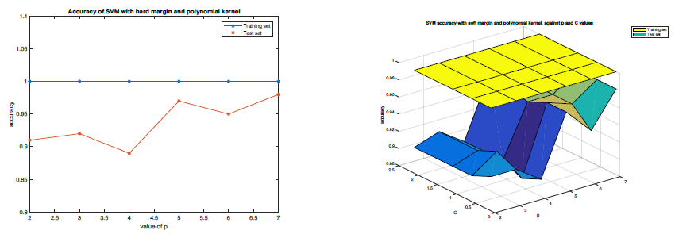

# SVM FOR CLASSIFICATION OF CANCEROUS CELLS

This project demonstrates the implementation of Support Vector Machine (SVM) for the purpose of understanding its  principles and issues for classification

## Data

The data used in this project is the Wisconsin Diagnostic Breast Cancer (WDBC) Data Set1. The samples were obtained by Fine Needle Aspiration (FNA) Biopsy, which is a procedure that involves passing a thin needle through the skin to sample fluid or tissue from a cyst or solid mass, as illustrated in Figure 1. The sample of cellular material taken during an FNA is then sent to a pathology laboratory for analysis. Figure 2 shows an image of cells obtained from FNA.

<table>
  <tr>
    <td>
      
    </td>
    <td>
      
    </td>
  </tr>
  <tr>
    <td>
      <strong>Fig. 1. Illustration of FNA Biopsy</strong>
    </td>
    <td>
      <strong>Fig. 2. Image of cells from FNA</strong>
    </td>
  </tr>
</table>


Each sample has 30 real-valued features that have been computed from a digitized image of a fine needle aspirate of a breast mass. They describe characteristics of the cell nuclei present in the image. In addition to these 30 features, each sample also contains a number (which serves
as an ID for the sample) and a label of either B (for benign) or M (for malignant). Thus, each type of label defines a class.

As an illustration, two samples are shown below. The first number in each sample is the ID, followed by the label and then by the 30 values for the features.

>883852, B, 11.3, 18.19, 73.93, 389.4, 0.09592, 0.1325, 0.1548, 0.02854, 0.2054, 0.07669, 0.2428, 1.642, 2.369, 16.39, 0.006663, 0.05914, 0.0888, 0.01314 0.01995, 0.008675, 12.58, 27.96, 87.16, 472.9, 0.1347, 0.4848, 0.7436, 0.1218, 0.3308, 0.1297

>842302, M, 17.99, 10.38, 122.8, 1001, 0.1184, 0.2776, 0.3001, 0.1471, 0.2419, 0.07871, 1.095, 0.9053, 8.589, 153.4, 0.006399, 0.04904, 0.05373, 0.01587, 0.03003, 0.006193, 25.38, 17.33, 184.6, 2019, 0.1622, 0.6656, 0.7119, 0.2654, 0.4601, 0.1189

Two group of samples have been selected from the original WDBC data set to form a training set (with 285 samples) and a test set (with 100 samples). Another group of 100 samples are then selected from the remaining samples in the WDBC data set to form an evaluation set. This evaluation set is not available to the students, and is to be used to evaluate the performance of the SVM program submitted by the students, as part of the assessment scheme described later in Section V.

The training set and the test set are included in the zipfile that also contains this document. They are in the MATLAB MAT-file format, with the file names train.mat and test.mat. They can be directly loaded into MATLAB. Each of these two MAT-files contains two variables: the matrix variable data in which each column represents one sample, and the variable label which contains the class label (i.e., +1 for B and -1 for M) of the samples.

## Dataset

The dataset resulting from the samples obtained by a Fine Needle Biopsy have 30 attributes - ID, diagnosis and 30 real-valued input features.

### Attribute information
```
1. ID number
2. Diagnosis (M = malignant, B = benign)
3. Ten real-valued features are computed for each cell nucleus:
  a) radius (mean of distances from center to points on the perimeter)
  b) texture (standard deviation of grey-scale values)
  c) perimeter
  d) area
  e) smoothness (local variation in radius lengths)
  f) compactness (perimeter^2 / area - 1.0)
  g) concavity (severity of concave portions of the contour)
  h) concave points (number of concave portions of the contour)
  i) symmetry
  j) fractal dimension ("coastline approximation" - 1)
The nucleus of a cancerous cell is often larger and darker than of a normal cell and its shape and size is not uniform.
```
## Support Vector Machine

There are many ways to separate data. However, is there an optimal way? The Support Vector Machine theory provides a systematic method for separating data optimally. The focus is on finding the margin which gives a maximum distance between the separable classes.

Compared to MLP, SVM has following advantages –
1. Solution found by SVM is optimal where as MLP finds one of the many solutions.
2. Structure of SVM is simple.
3. The solution process is tractable whereas MLP does not guarantee convergence.

The solution process of Support Vector Machine (SVM) focuses on finding a hyperplane that divides a set of samples into two categories (here, benign and malign cells). To achieve this, we must find a hyperplane which keeps the samples as far away as possible.

The margin can be of two types –
1. **Hard margin**: This margin works best for data set where the samples strictly do not fall inside the region of separation.
2. **Soft margin**: This margin works best for data set where samples may not linearly separable.

<table>
  <tr>
    <td>
      
    </td>
    <td>
      
    </td>
  </tr>
  <tr>
    <td>
      <strong>Fig 3. Optimal hyperplane with hard margin</strong>
    </td>
    <td>
      <strong>Fig 4. Optimal hyperplane with soft margin</strong>
    </td>
  </tr>
</table>

Another approach for sample that are not linearly separable is to transform them to higher dimensions. This increases the probability of the samples being linearly separable in higher dimensional space. The transformation can be achieved by using a kernel. For this classification, we use linear and polynomial kernels.

<table>
  <tr>
    <td>
      
    </td>
  </tr>
  <tr>
    <td>
      <strong>Fig 5. Transformation to higher dimensional space using a kernel</strong>
    </td>
  </tr>
</table>

## Implementation

### The Kernels

1. A hard-margin SVM with a linear kernel - *K(x<sub>1</sub>, x<sub>2</sub>) = x<sup>T</sup><sub>1</sub>x<sub>2</sub>*

2. A hard-margin SVM with a polynomial kernel - *K(x<sub>1</sub>, x<sub>2</sub>) = (x<sup>T</sup><sub>1</sub>x<sub>2</sub> + 1)<sup>p</sup>*

   where the values of p are listed in Table 1.
  
3. A soft-margin SVM with a polynomial kernel as given in Equation (2) above, and with the values for p and C as listed in Table 1.

The Kernel is implemented in get_kernel.m file. The third argument is the value of p. The Kernel is linear when p is 0 and polynomial otherwise.
 
The algorithm for calculating the values of alpha and b0 is implemented in solve_alpha.m and solve_b0.m Matlab functions. Alpha is calculated using [quadprog](https://www.mathworks.com/help/optim/ug/quadprog.html) function in Matlab.

### SVM

A MATLAB (M-file) program to implement the SVMs with the discriminant functions found in the kernels above. Apply these SVMs to classify the given training set and test set, and report the classification results in Table 1 by filling in the values for the entries indicated by "?".

1. t2_1_hmlk.m: SVM using hard margin with linear kernel
2. t2_2_hmpk.m: SVM using hard margin with polynomial kernel
3. t2_3_smpk.m: SVM using soft margin with polynomial kernel

The execution results are listed below in Table 1. In all cases, the training accuracy is 100%. Test accuracy on the other hand drops in all cases. It is observed that the test performance of SVM with polynomial kernel increases with the value of p. The best performance can be seen in the below table where the value of p is 5.

#### Result - Table 1

<table>
  <thead>
    <tr>
      <th>Type of SVM</th>
      <th scope="col" colspan="4">Training accuracy</th>
      <th scope="col" colspan="4">Test accuracy</th>
    </tr>
  </thead>
  <tbody>
    <tr>
      <td>Hard margin with Linear kernel</td>
      <td scope="col" colspan="4">1</td>
      <td scope="col" colspan="4">0.91</td>
    </tr>
    <tr>
      <td scope="row" rowspan="2">Hard margin with Polynomial kernel</td>
      <td><em>p = 2</em></td>
      <td><em>p = 3</em></td>
      <td><em>p = 4</em></td>
      <td><em>p = 5</em></td>
      <td><em>p = 2</em></td>
      <td><em>p = 3</em></td>
      <td><em>p = 4</em></td>
      <td><em>p = 5</em></td>
    </tr>
    <tr>
      <td>1</td>
      <td>1</td>
      <td>1</td>
      <td>1</td>
      <td>0.91</td>
      <td>0.92</td>
      <td>0.89</td>
      <td>0.97</td>
    </tr>
    <tr>
      <td>Soft margin with Polynomial kernel</td>
      <td><em>c = 0.1</em></td>
      <td><em>c = 0.6</em></td>
      <td><em>c = 1.1</em></td>
      <td><em>c = 2.1</em></td>
      <td><em>c = 0.1</em></td>
      <td><em>c = 0.6</em></td>
      <td><em>c = 1.1</em></td>
      <td><em>c = 2.1</em></td>
    </tr>
    <tr>
      <td><em>p = 2</em></td>
      <td>1</td>
      <td>1</td>
      <td>1</td>
      <td>1</td>
      <td>0.92</td>
      <td>0.91</td>
      <td>0.91</td>
      <td>0.91</td>
    </tr>
    <tr>
      <td><em>p = 3</em></td>
      <td>1</td>
      <td>1</td>
      <td>1</td>
      <td>1</td>
      <td>0.92</td>
      <td>0.93</td>
      <td>0.92</td>
      <td>0.92</td>
    </tr>
    <tr>
      <td><em>p = 4</em></td>
      <td>1</td>
      <td>1</td>
      <td>1</td>
      <td>1</td>
      <td>0.90</td>
      <td>0.89</td>
      <td>0.90</td>
      <td>0.90</td>
    </tr>
    <tr>
      <td><em>p = 5</em></td>
      <td>1</td>
      <td>1</td>
      <td>1</td>
      <td>1</td>
      <td>0.97</td>
      <td>0.97</td>
      <td>0.96</td>
      <td>0.97</td>
    </tr>
  </tbody>
</table>

> **Accuracy plots**



